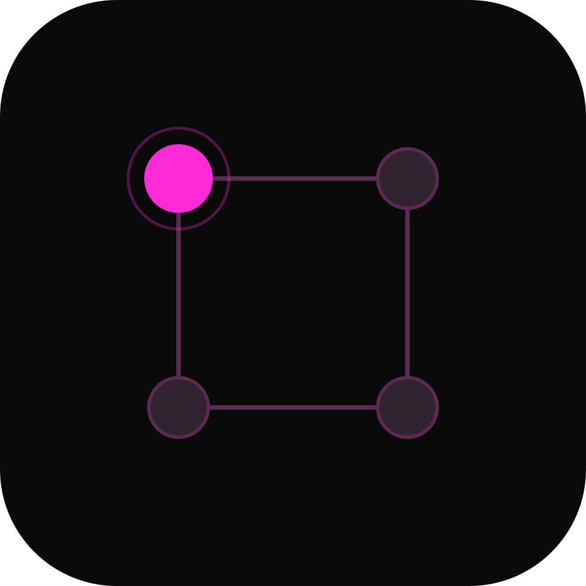

# QuadPlan

Local-first planning team for pre-development proposals, tickets, and design review.

QuadPlan coordinates a planning team of 3 AI agents — HEAD, RE1, and RE2 — through the proposal to tickets to design artifacts to reviewer approval loop. Butler handles new project intake from the Home screen.

## Quick Start

```bash
npx quadplan init     # one-time setup
npx quadplan start    # start the dashboard
```

Open `http://localhost:8500` in your browser.

QuadPlan is designed to run side-by-side with QuadWork. QuadWork keeps the
`quadwork` command, `~/.quadwork` runtime, and its usual `8400` port. QuadPlan
uses the `quadplan` command, `~/.quadplan` runtime, and `8500` by default.

## How It Works

1. **Butler** takes a raw idea and drafts a detailed `PROPOSAL.md`
2. **HEAD** creates GitHub tickets, HTML designs, and docs from the proposal
3. **RE1 + RE2** review every artifact independently — both must approve
4. **Planning Loop** keeps the queue moving overnight without manual triggering

## Agent Model

| Agent | Role | Authority |
|-------|------|-----------|
| Butler | Intake + proposal creation | Global (Home screen) |
| HEAD | Project lead + planning worker | Artifact production |
| RE1 | Independent reviewer 1 | VETO (design/planning) |
| RE2 | Independent reviewer 2 | VETO (design/planning) |

## Stack

- **Frontend**: Next.js App Router, TypeScript, Tailwind CSS, static export
- **Backend**: Node.js, Express, WebSocket
- **Terminals**: `node-pty` + `xterm.js`
- **Chat**: File-based JSONL + MCP shim
- **GitHub**: `gh` CLI integration
- **Config**: `~/.quadplan/config.json`

## Project Layout

```
~/.quadplan/
  config.json                 # Global config
  {project_id}/
    chat/                     # File-based agent chat
    OVERNIGHT-QUEUE.md        # Planning artifact queue
    history-snapshots/        # Chat history snapshots

{project_repo}/
  docs/PROPOSAL.md            # Project proposal
  artifacts/
    design/                   # HTML design artifacts
    tickets/                  # Ticket batch drafts
    docs/                     # Supporting documents
```

## Dashboard

- **Home**: Butler-first intake surface + project cards
- **Project**: Chat panel + HEAD/RE1/RE2 terminals + GitHub issues + artifact browser + Planning Loop controls
- **Settings**: Agent models, dashboard port, loop guard

## Planning Artifacts

| Type | Description |
|------|-------------|
| `proposal` | Full project proposal |
| `ticket_batch` | Group of GitHub issues |
| `design_html` | HTML design for browser review |
| `doc` | Supporting documentation |
| `proposal_revision` | Updated proposal after scope change |

## Planning Loop

Sends periodic queue-check pulses to HEAD. Configurable intervals: 5, 10, 15, or 30 minutes. Default: 10 minutes. Loop guard prevents runaway agent chains.

## Visual Identity

Neon pink / magenta accent (`#ff2bd6`) on dark background. Quad-grid planning mark with one active node.

## License

MIT
